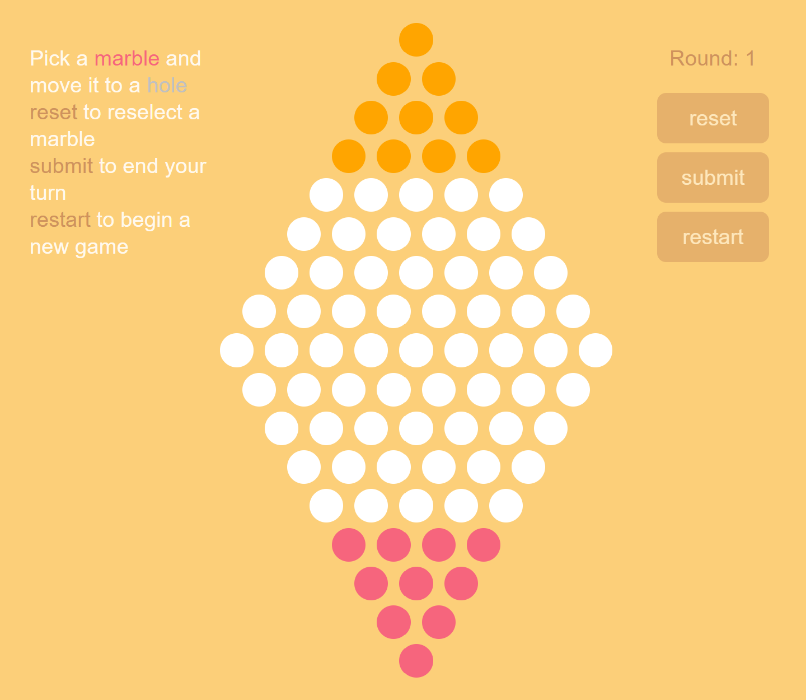

# MarbleFish: A Chinese Checkers AI

> [!Note]
>
> The original code (written in Python 2.x) of this repository has been moved under the `legacy` branch. Refer to readme there for a detailed algorithm design documentation.

MarbleFish is now remade as a web application. You can play it [here](https://arthur-x.github.io/MarbleFish/). Using Chrome is recommended.

